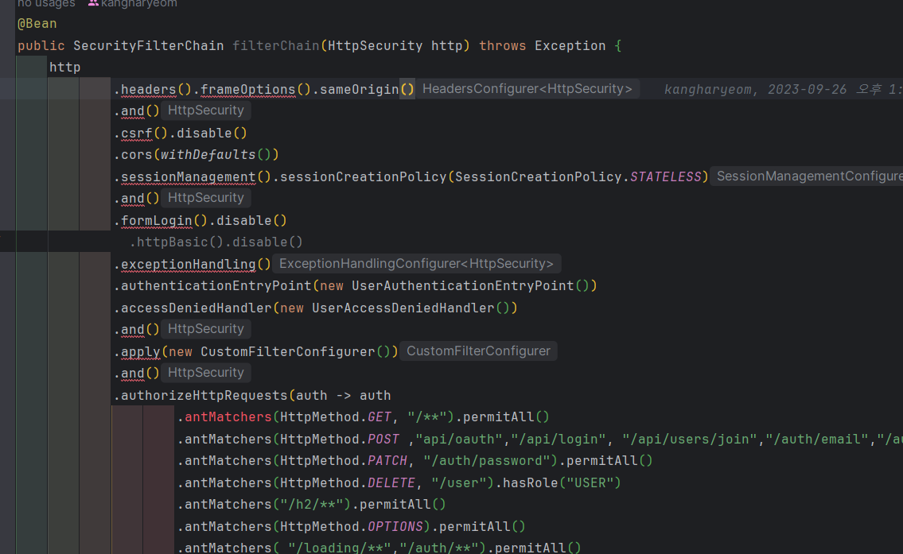

# Http Security 에러

## 트러블 슈팅 개요

spring boot 2.7.14에서 spring boot 3.2.3로 프로젝트 마이그레이션 진행 중 SecurityConfiguration에서
```
'frameOptions()' is deprecated since version 6.1 and marked for removal 
```
에러가 발생했다.

이 에러는 Spring Security 6 환경에서 'websecurityconfigureradapter'가 deprecated 되었기 때문인데
Spring 3.1.0 이상의 환경에서는 Spring Security 6.1.0 버전을 따라야 하며 기존 방식이었던 메서드 체인 방식을 지양하고
람다식을 통한 함수형으로 코딩해야합니다.

## AS-IS와 TO-BE 비교
AS-IS 코드는 메서드 체인 방식으로 ```메서드(). 메서드()``` 의 연속으로 코드가 구성되어 있다.

```java
@Bean
    public SecurityFilterChain filterChain(HttpSecurity http) throws Exception {
        http
                .headers().frameOptions().sameOrigin()
                .and()
                .csrf().disable()
                .cors(withDefaults())
                .sessionManagement().sessionCreationPolicy(SessionCreationPolicy.STATELESS)
                .and()
                .formLogin().disable()
                .httpBasic().disable()
                .exceptionHandling()
                .authenticationEntryPoint(new UserAuthenticationEntryPoint())
                .accessDeniedHandler(new UserAccessDeniedHandler())
                .and()
                .apply(new CustomFilterConfigurer())
                .and()
                .authorizeHttpRequests(auth -> auth
                        .antMatchers(HttpMethod.GET, "/**").permitAll()
                        .antMatchers(HttpMethod.POST ,"api/oauth","/api/login", "/api/users/join","/auth/email","/auth/password").permitAll()
                        .antMatchers(HttpMethod.PATCH, "/auth/password").permitAll()
                        .antMatchers(HttpMethod.DELETE, "/user").hasRole("USER")
                        .antMatchers("/h2/**").permitAll()
                        .antMatchers(HttpMethod.OPTIONS).permitAll()
                        .antMatchers( "/loading/**","/auth/**").permitAll()
                        .anyRequest().authenticated()
                )
                .oauth2Login(oauth2 -> oauth2
                        .successHandler(new OAuth2UserSuccessHandler(jwtTokenizer, userRepository,redisUtils))
                        .userInfoEndpoint().userService(oAuth2UserService)
                );

        return http.build();

    }
```

메서드 체인 방식의 장점은 가독성 향상에 있다. 짧은 문장 안에 연속적으로 메서드를 호출 할 수 있기 때문에 가독성이 향상된다.
다만, 한 문장에 여러가지 메서드가 존재할 수 있으므로 에러가 발생할 경우 정확한 지점을 알기 힘들다는 단점이 있다.

<br/>
<br/>

TO-BE 코드는 Spring Security 6.1 버전 이상에서 적용되는 방식으로 Lambda DSL 방식이다.
Lambda DSL 방식은 and()를 사용하지 않아도 되며 들여쓰기로 인해 메소드 단위 코드 구성을 읽기 쉽다는 장점이 있다.
```java
@Bean
    public SecurityFilterChain filterChain(HttpSecurity http) throws Exception {
        http
                .csrf((csrfConfig)->
                        csrfConfig.disable()
                )
                .headers((headerConfig)->
                        headerConfig.frameOptions((frameOptionsConfig ->
                                frameOptionsConfig.sameOrigin())
                        )
                )
                .cors(withDefaults())
                .sessionManagement((sessionManagementConfig)->
                        sessionManagementConfig.sessionCreationPolicy(SessionCreationPolicy.STATELESS)
                )
                .formLogin((formLoginConfig)->
                        formLoginConfig.disable()
                )
                .exceptionHandling((exceptionConfig) ->
                        exceptionConfig.authenticationEntryPoint(new UserAuthenticationEntryPoint()).accessDeniedHandler(new UserAccessDeniedHandler())
                )
                .authorizeHttpRequests((auth) -> auth
                        .requestMatchers(HttpMethod.GET, "/**").permitAll()
                        .requestMatchers(HttpMethod.POST ,"api/oauth","/api/login", "/api/users/join","/auth/email","/auth/password").permitAll()
                        .requestMatchers(HttpMethod.PATCH, "/auth/password").permitAll()
                        .requestMatchers(HttpMethod.DELETE, "/user").hasRole("USER")
                        .requestMatchers("/h2/**").permitAll()
                        .requestMatchers(HttpMethod.OPTIONS).permitAll()
                        .requestMatchers( "/loading/**","/auth/**").permitAll()
                        .anyRequest().authenticated()
                )
                .oauth2Login(oauth2 -> oauth2
                        .successHandler(new OAuth2UserSuccessHandler(jwtTokenizer, userRepository,redisUtils))
                        .userInfoEndpoint(userInfoEndpointConfig ->
                                userInfoEndpointConfig.userService(oAuth2UserService)
                        )
                );

        return http.build();

    }
```
메서드 체인의 장점이었던 가독성 향상은 깊이가 깊을수록 코드를 이해하기 힘들다는 단점이 있는 반면
```
ex) 메서드1().메서드2().메서드3().메서드4().메서드5().메서드6().메서드7().메서드8().메서드9()
```
Lambda DSL 방식은 깊은 depth 에서도 어떤 메서드를 활용하는지 쉽게 알아볼 수 있다는 장점이 있다. 
```
ex) 메서드1((메서드1Config)->
        메서드1Config.메서드2((메서드2Config)->
            메서드2Config.메서드3((메서드3Config)->
                메서드3Config.메서드4((메서드4Config)->
                    메서드4Config.메서드5((메서드5Config)->
                        메서드5Config.메서드6())
                        )
                    )
                )
            )
        )
    )
```
따라서 Spring Security 6.1 버전에서 새롭게 적용된 Lambda DSL은 메서드 중첩으로 인해 발생할 수 있는 
오류나 개발자의 실수를 개선하기 위한 방식이라고 할 수 있다.

